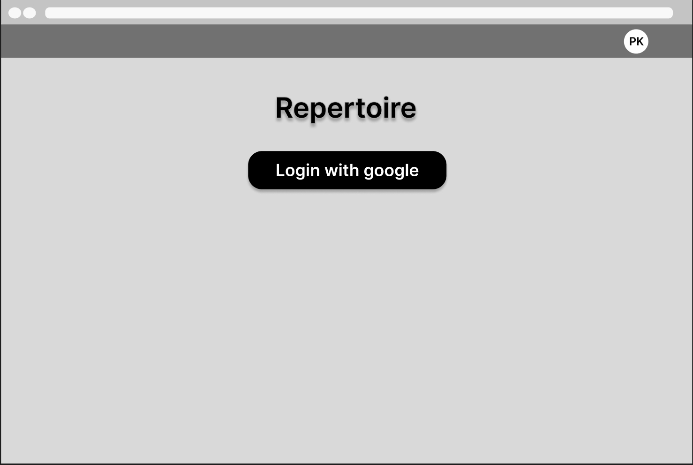
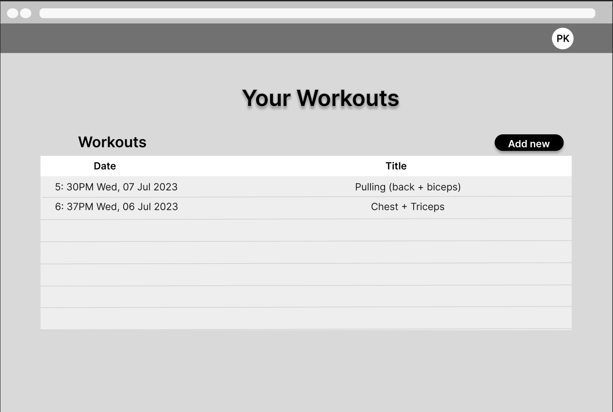
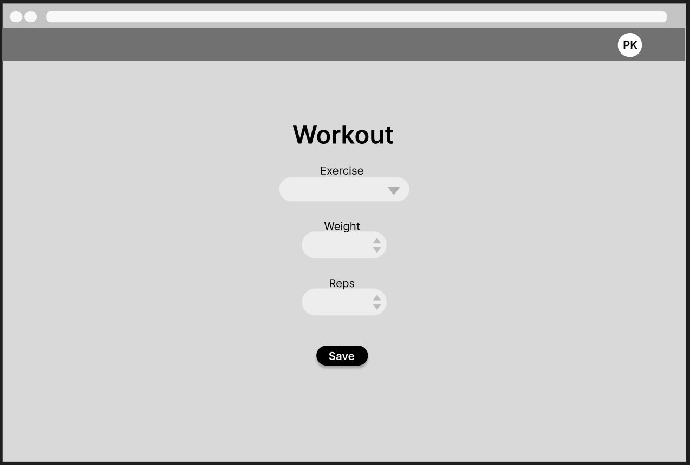
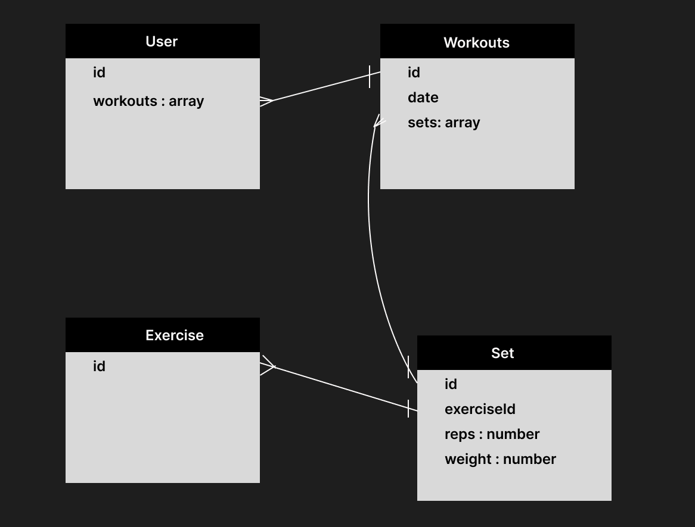

# Repertoire
A workout tracking app. It allows Users to login, track their workouts.
It also uses an API [ExerciseAPI](https://rapidapi.com/justin-WFnsXH_t6/api/exercisedb/details) to generate the list of exercises a user can choose. 

## Wireframes
### Homepage

### Workouts Index

### Workouts Show

### Set

## ERD Database Planning

## RESTful Routing 
| Method | URL Path               | Action  | CRUD Operation                     |
|--------|------------------------|---------|------------------------------------|
| GET    | /workouts              | index   | Read all workouts                  |
| GET    | /workouts/:id          | show    | Return view to add                 |
| POST   | /workouts              | create  | Create new workout                 |
| PUT    | /workouts/:id          | update  | Update workout                     |
| DELETE | /workouts/:id          | destroy | Destroy workout                    |
| GET    | /workouts/:id/sets     | index   | read all sets belonging to workout |
| GET    | /workouts/:id/sets/:id | show    | read one set                       |
| POST   | /workouts/:id/sets     | create  | Create a new set within workout    |
| PUT    | /workouts/:id/sets/:id | update  | Update a set                       |
| DELETE | /workouts/:id/sets/:id | destroy | Destroy a set                      |

## User Stories
* AAU I want to see a list of my workouts on my homepage
* AAU I want to be able to add a workout quickly and add sets within the same page
* AAU I want to search exercises by muscle, body-part and equipment

## MVP
* User Authentication
* Add workouts
* Add sets to workouts
* Add reps to sets
* Use the exerciseDB API

## Stretch Goals
* A nicer front-end maybe using a library
    * Bringing views together, being able to add workout, exercise and set at the same time
* User metric tracking, e.g BMI, progress pics, body fat %
* Built in login, or more login options