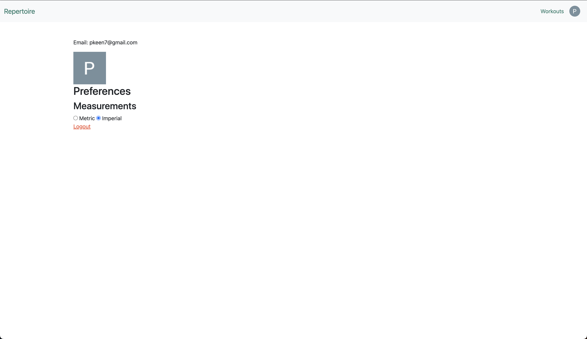

# Repertoire
A workout tracking app. It allows Users to track their workouts, exercises and reps.

It uses an API [ExerciseAPI](https://rapidapi.com/justin-WFnsXH_t6/api/exercisedb/details) to get a list of exercises to choose from with helfpul gifs showing how to do them.

## Screenshots
### Homepage

### Workouts Index

### Workouts Show

### User/Options

## Technology Used
* Node
* Express
* MongoDB
* Mongoose
* Javascript
* Bootstrap CSS
* Sass

## Getting Started
<Link to app to come>

## Next steps
* Workout Templates
* Front end, client-side AJAX. 
* Dont include weight on certain exercises i.e. body weight exercises
* Personal Tracking
* Native login

## RESTful Routing 
| Method     | URL Path                             | Action  | CRUD Operation                     |
|------------|--------------------------------------|---------|------------------------------------|
| GET        | /workouts                            | index   | Read all workouts                  |
| GET        | /workouts/:id                        | show    | Return view to add                 |
| POST       | /workouts                            | create  | Create new workout                 |
| PUT        | /workouts/:id                        | update  | Update workout                     |
| DELETE     | /workouts/:id                        | destroy | Destroy workout                    |
| GET        | /workouts/:id/exercises              | index   | read all sets belonging to workout |
| GET        | /workouts/:id/exercises/:id          | show    | read one set                       |
| POST       | /workouts/:id/exercises              | create  | Create a new set within workout    |
| PUT        | /workouts/:id/exercises/:id          | update  | Update a set                       |
| DELETE     | /workouts/:id/exercises/:id          | destroy | Destroy a set                      |
| GET        | /workouts/:id/exercises/:id/sets     |         |                                    |
| GET        | /workouts/:id/exercises/:id/sets/:id |         |                                    |
| POST       | /workouts/:id/exercises/:id/sets     |         |                                    |
| PUT/DELETE | /workouts/:id/exercises/:id/sets/:id |         |                                    |

## User Stories
* AAU I want to see a list of my workouts on my homepage ✅
* AAU I want to be able to add a workout quickly and add sets within the same page ✅
* AAU I want to search exercises by muscle, body-part and equipment ✅
* AAU I want to be able to change the exercise without deleting the sets ✅

